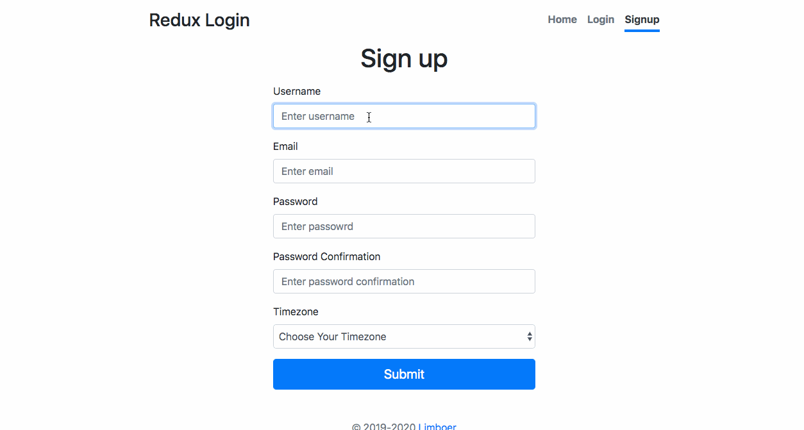

# Redux Login

使用 React + Redux + Express 搭建的前后端分离项目. 包含基本的登录验证, 权限路由管理, 以及表单验证

## 预览

预览: http://redux-login.limbo.today/

预览效果: 



## 安装

```bash
# 克隆并安装依赖
$ git clone https://github.com/hacker0limbo/redux-login.git && cd redux-login
$ npm install

# 进入 server 目录, 新建一个 .env 文件并写入 jwt 秘钥
# 例如 JWT_PRIVATE_KEY=jwt_private_key
$ cd server
$ echo "JWT_PRIVATE_KEY=jwt_private_key" > .env

# 初始化数据库, 创建 schema
$ npm run initdb

# 客户端和服务端开启项目
$ npm start
$ npm run server
```
